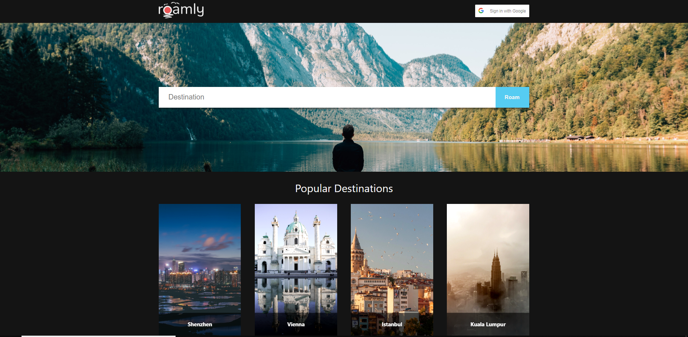

# Roamly ("Travel Website")


You can find the deployed project at [roamly.app](https://roamly.app/).

## Contributors

| [Alyssa Saez](https://github.com/AlyssaSaez) | [Arron Marshall](https://github.com/arronm) | [Jamie Hall](https://github.com/JamieHall1962) | [Josh Timmons](https://github.com/josh182014) |
|:-:|:-:|:-:|:-:|
| [](https://github.com/xCthaeh) | [](https://github.com/arronm) | [](https://github.com/JamieHall1962) | [](https://github.com/josh182014) |
| [ ](https://github.com/AlyssaSaez) | [ ](https://github.com/arronm) | [ ](https://github.com/JamieHall1962) | [ ](https://github.com/josh182014) |
| [  ](https://www.linkedin.com/in/alyssasaez/) | [  ](https://www.linkedin.com/in/arronm) | [  ](https://www.linkedin.com/) | [  ](https://www.linkedin.com/in/josh-timmons-851216132) |

| [Nguyen Vo](https://github.com/azinoVo) | [Ryan Matthews](https://github.com/Ryntak94) | [3](https://github.com/) | [4](https://github.com/) |
|:-:|:-:|:-:|:-:|
| [](https://github.com/azinoVo) | [](https://github.com/Ryntak94) | [](https://github.com/) | [](https://github.com/) |
| [ ](https://github.com/azinoVo) | [ ](https://github.com/Ryntak94) | [ ](https://github.com/) | [ ](https://github.com/) |
| [  ](https://www.linkedin.com/) | [  ](https://www.linkedin.com/in/ryntak94) | [](https://www.linkedin.com/) | [](https://www.linkedin.com/) |


# Project Overview

[Trello Board](https://trello.com/b/kBQIxBnm)

[Product Canvas](https://www.notion.so/Travel-Website-Roamly-app-69b7026b663c4447b6ed95fb5b914fa8)

As envisoned, Roamly is an itinerary builder built for Web and Android. The Web application should allow users to view, favorite, and un-favorite attractions for a destination and then add/remove those attractions to/from their itinerary. The Android counterpart should allow for users to easily view their itinerary on-the-go while they are roamly-ing. 

### Web Key Features
-    Google Login
-    Search Attractions for a Destination
-    View Attractions and Relevant Info
-    Favorite or Un-Favorite Attractions
-    View Favorites in a User Profile

# Tech Stack - Front End

### Front End built using:
- React with Hooks for Framework
- Styled using CSS Modules and SASS Preprocessor
- Continuous Integration using Travis CI
- Analytics using FullStory, Google Analytics, and Heap Analytics
- Error Tracking using Sentry

#### Framework: React with Hooks
- Hooks provided better separation of business logic for long-term maintainability

#### Styling: CSS Modules and SASS
- No library meant more unique/diverse styles
- SASS is built into create-react-app
- CSS Module gives better name-spacing to avoid className conflicts

#### Continuous Integration: Travis CI

Travis CI benefit(s) :
- Prevents bad code from reaching production
- Gives mandatory break time for nerf wars
- Ensures your codebase passes all testing/linting/coverage requirements

#### Analytics: FullStory, Google Analytics, Mixpanel, and Heap Analytics
- FullStory lets you see how users are using your website
  - It is a very powerful tool that acts as a user case study with real interaction
  - Also shows potential issues with loading and rage clicks (e.g. elements that look like buttons)
- Heap Analytics let's you look at event flows in the past
  - If you forget to set up an event, with other analytics you will have lost data
  - With Heap you can look at past data to recover the event that you wanted data on
- Google Analytics is industry standard for website analytics, has a lot of beneficial features and insights


#### Exception Tracking: Sentry
- Sentry will automatically log session that throw exceptions for users
  - Excellent Error Logs
  - Can stack trace in the users browser
  - Provides useful debugging information, such as browser, os, location experiencing an error

#### Front End deployed to [Netlify](https://www.netlify.com/)

# Tech Stack - Back End

### [Back End](https://github.com/labs14-travel-website/backend) built using:
- Environment is Node.js
- Framework is Express.js
- Database is PostgreSQL
- Query Builder using Knex.js
- Data Access using GraphQL

### Environment: Node.js
- Easy to learn
- Scalable
- Benefit of fullstack JS
- Fast / High Performance

#### Database: PostgreSQL
- Supported by Heroku
- Data won't be wiped like SQLite
- Diverse indexing
- Flexible full-text search

#### Query Builder: Knex
- Familiarity and pairs well with SQL
- Abstracts SQL queries into Javascript
- Straight-forward migration/seeding

#### Data Access: GraphQL
- Request specific data from the endpoints
- Receive data in a predictable way

#### Back End deployed to [Heroku](https://heroku.com)


# APIs

## Authentication: OAuth and Google Login

We use Google SignOn to handle user authentication securely without having to store the information directly on our server. We considered using normal JSON Web Tokens, but OAuth is more secure and Google SignOn provides an easier login experience for users.

## Content: Google Places API

This is the core of our application. It provides a lot of the information that we need such as: Destination search, points of interest, restaurants, etc. When a user searches for a destination we send a places request for that search which returns a list of attractions to visit near that location. In a future release this can be expanded upon to pull places to eat as well.

We considered Sygic API which seemed like a perfect fit, but they stopped giving out API access to students.

## Descriptions: Google Knowledge Graph

This API lets us pull descriptions for the attractions. When a user clicks on a card we send a knowledge graph request for the attraction name.

# Environment Variables
    *  REACT_APP_OAUTH_GOOGLE_ID - Your Google OAuth credentials ID
    *  REACT_APP_ENDPOINT - The endpoint for the server, default for local is port 8000
    *  REACT_APP_MP_TOKEN - Mixpanel account token
    *  REACT_APP_GA_TOKEN - Google Analytics account token
    *  REACT_APP_FS_TOKEN - Fullstory account token;
    *  REACT_APP_HA_TOKEN - Heap Analytics account token;

# Testing

## Testing done using:
- Unit Testing using Jest and Enzyme
- End to End Testing using Cypress
- Code Quality using ESLint

#### Unit Testing: Jest and Enzyme
- Jest and React was made by same group
- Jest offers powerful assertion tools
- Enzyme offers powerful mounting and selector tools

#### End to End Testing: Cypress
- Excellent documentation and well supported
- Great for testing `golden path` for users to make sure future releases don't break anything
- Stubbing is an excellent tool for testing state

#### Code Quality: ESLint
- Industry Standard JS Code checker
- Using Airbnb styles

# Installation Instructions

**NOTES:**
 - We are using Yarn, duplicate lock files will cause build failures
 - You will need a local version of the server running as well

Commands:
```
$ git clone https://github.com/labs14-travel-website/frontend.git
$ yarn
$ git checkout -b feature/new-feature
$ yarn start
```

## Other Scripts

```
start - Starts the create-react-app scripts
build - Compiles the code into a production-ready build
jest:coverage - Runs jest with coverage reporting
jest:start - Runs standard jest tests
cypress:start - Run cypress tests, primarily for CI
lint:start - Run ESLint against files
lint:fix - Automatically fixes lint errors where possible
heroku-postbuild - Sets up db migrations for heroku deployment
```

# Contributing

When contributing to this repository, please first discuss the change you wish to make via issue, email, or any other method with the owners of this repository before making a change.

Please note we have a [code of conduct](./CODE_OF_CONDUCT.md). Please follow it in all your interactions with the project.

## Issue/Bug Request
   
 **If you are having an issue with the existing project code, please submit a bug report under the following guidelines:**
 - Check first to see if your issue has already been reported.
 - Check to see if the issue has recently been fixed by attempting to reproduce the issue using the latest master branch in the repository.
 - Create a live example of the problem.
 - Submit a detailed bug report including your environment & browser, steps to reproduce the issue, actual and expected outcomes,  where you believe the issue is originating from, and any potential solutions you have considered.

### Feature Requests

We would love to hear from you about new features which would improve this app and further the aims of our project. Please provide as much detail and information as possible to show us why you think your new feature should be implemented.

# Pull Requests

If you have developed a patch, bug fix, or new feature that would improve this app, please submit a pull request. It is best to communicate your ideas with the developers first before investing a great deal of time into a pull request to ensure that it will mesh smoothly with the project.

Remember that this project is licensed under the MIT license, and by submitting a pull request, you agree that your work will be, too.

#### Pull Request Guidelines

- Ensure any install or build dependencies are removed before the end of the layer when doing a build.
- Update the README.md with details of changes to the interface, including new plist variables, exposed ports, useful file locations and container parameters.
- Ensure that your code conforms to our existing code conventions and test coverage.
- Include the relevant issue number, if applicable.
- You may merge the Pull Request in once you have the sign-off of two other developers, or if you do not have permission to do that, you may request the second reviewer to merge it for you.

# Attribution

These contribution guidelines have been adapted from [this good-Contributing.md-template](https://gist.github.com/PurpleBooth/b24679402957c63ec426).

# Documentation

See [Backend Documentation](https://github.com/labs14-travel-website/backend/blob/master/README.md) for details on the backend of our project.
